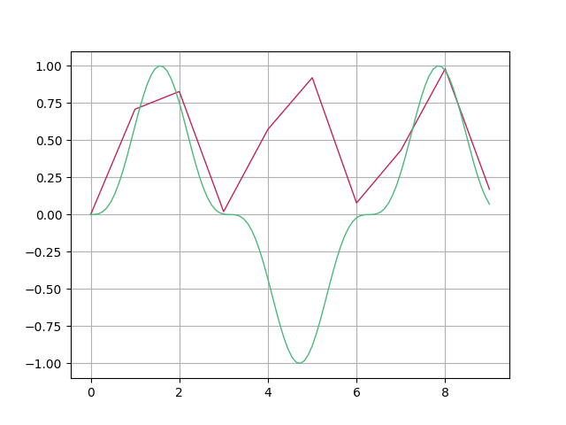
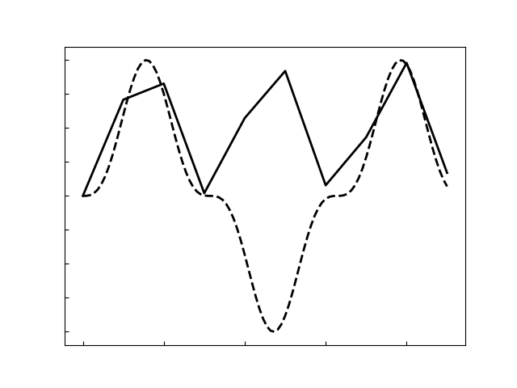
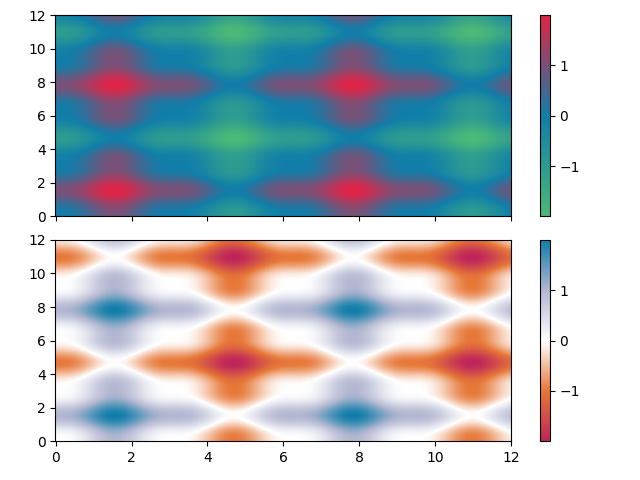
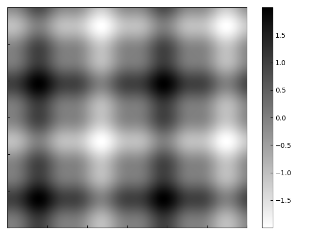

# phdhelper

## Installation

1.  Clone the repository and navigate to the root folder.
1.  If using `virtualenv` make sure to `workon` the environment you wish to install in.
1.  Run the following command to install an editable version of the module to your python installation using pip:
    ```bash
    pip install -e .
    ```
    The `-e` stands for 'editable' & means that any edits to the code are updated live across any/all installs without needing to `pip install` again.
1.  To update the module to latest, simply `git pull`

## Structure

```
. @ Wed  2 Jun 2021 16:30:59 BST
├── .gitignore
├── LICENSE
├── README.md
├── phdhelper
│   ├── __init__.py
│   ├── __main__.py
│   ├── exceptions
│   │   ├── __init__.py
│   │   └── phdException.py
│   ├── helpers
│   │   ├── COLOURS.py
│   │   ├── CONSTANTS.py
│   │   ├── __init__.py
│   │   ├── format_timestamps.py
│   │   ├── os_shortcuts.py
│   │   └── override_mpl.py
│   ├── math
│   │   ├── __init__.py
│   │   ├── signal_processing.py
│   │   └── transforms.py
│   ├── suMMSary
│   │   ├── __init__.py
│   │   └── suMMSary.py
│   └── tests
│       ├── __init__.py
│       ├── helpers
│       │   ├── __init__.py
│       │   └── array_summary_test.py
│       └── math
│           ├── __init__.py
│           ├── autocorrelate_beating.npy
│           ├── autocorrelate_bigarray.npy
│           └── signal_processing_testes.py
└── setup.py

8 directories, 26 files

```

### helpers

Contains most of the helper code.

#### COLOURS

Constants file containing colours (hex string) consistent with theme.

```python
from phdhelper.helpers.COLOURS import red, green, blue

print(red, green, blue)
```

Returns

```
#BF245A #4BB977 #107EA9
```

#### CONSTANTS

Contains various astrophysical constants as pure floats, similar to np.pi=3.14159265...

```python
from phdhelper.helpers.CONSTANTS import *

print(f"Permittivity of free space: {epsilon_0}")
print(f"Speed of light: {c}")
```

Returns

```
Permittivity of free space: 8.85418782e-12
Speed of light: 299792458.0
```

#### os_shortcuts

Contains helpers for navigating os. Includes get_path & new_path

```python
from phdhelper.helpers.os_shortcuts import get_path, new_path

data_src = get_path(__file__, "..")  #  Full path to directory above current file
save_path = new_path(get_path(__file__))


# Generate data...

print(f"Path of data: {data_src}")
print(f"Save to path: {save_path('filename.txt')}")

```

Returns

```
Path of data: /Users/jamesplank
Save to path: /Users/jamesplank/Desktop/filename.txt
```

#### override_mpl

Routines for customising the default behaviour of matplotlib.

Contains an `override()` method which when called in a script will override some matplotlib defaults, including setting default colours (using the ones in COLOURS), changing line width, adding a grid, etc...

```python
from phdhelper.helpers import override_mpl
from phdhelper.helpers.os_shortcuts import *
import matplotlib.pyplot as plt
import numpy as np

override_mpl.override()
plots_path = new_path(get_path(__file__))

x = np.arange(10)
y = np.sin(x) ** 2

x2 = np.linspace(0, 9, 100)
y2 = np.sin(x2) ** 3

plt.plot(x, y)
plt.plot(x2, y2)
plt.savefig(plots_path("new_default.png"))
plt.close()

override_mpl.override("book_gs")
plt.plot(x, y)
plt.plot(x2, y2)
plt.savefig(plots_path("book_style.png"))

```

Returns

<p align="center">
    
    
</p>

Also contains `cmap()`. Currently only `"custom_diverging"` implemented. Use to initialise custom colour maps.

```python
import numpy as np
import matplotlib.pyplot as plt
from phdhelper.helpers import override_mpl, os_shortcuts

save_fig = os_shortcuts.new_path(os_shortcuts.get_path(__file__))

override_mpl.override()
override_mpl.cmaps("custom_diverging")

x, y = np.mgrid[0:12:1000j, 0:12:1000j]
z = np.sin(x) ** 3 + np.sin(y) ** 3

fig, ax = plt.subplots(2, 1, sharex=True, sharey=True)

im1 = ax[0].pcolormesh(x, y, z, shading="nearest")
fig.colorbar(im1, ax=ax[0])
im2 = ax[1].pcolormesh(
    x,
    y,
    z,
    cmap="custom_diverging",
    shading="nearest",
)
fig.colorbar(im2, ax=ax[1])
plt.tight_layout()
plt.savefig(save_fig("default_cmaps.png"))
plt.close()

override_mpl.override("book_gs")
plt.pcolormesh(x, y, z, shading="nearest")
plt.colorbar()
plt.tight_layout()
plt.savefig(save_fig("book_cmap.png"))

```

Returns

<p align="center">
    
    
</p>
